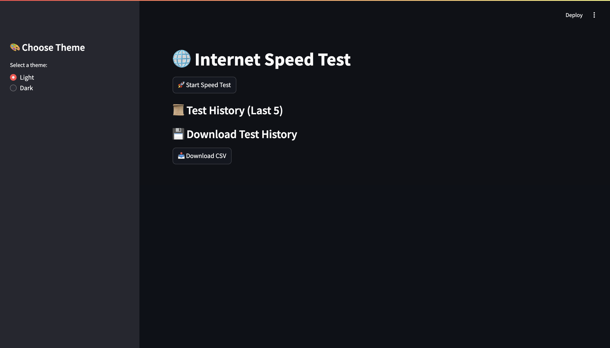
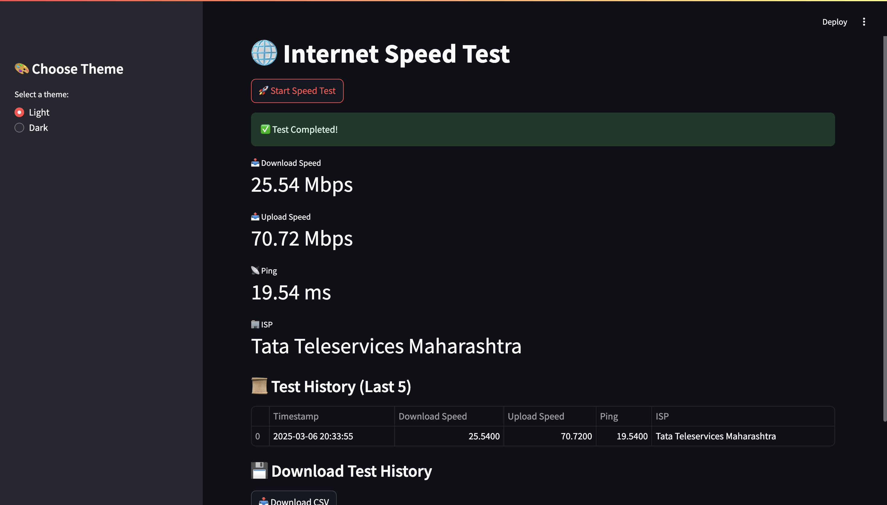

# 🌐 Internet Speed Test

## 📌 Project Title & Description
This is a simple **Internet Speed Test** application built using **Streamlit**. It allows users to check their **download speed, upload speed, and ping**, while also keeping a **history of past tests** and visualizing speed trends.

## 🔥 Unique Features Added
- 🚀 **One-click speed test**
- 📜 **History of the last 5 tests**
- 📊 **Graphical representation of speed trends**
- 🎨 **Light & Dark theme selection**
- 💾 **Download test history as a CSV file**
- 🏢 **Displays the Internet Service Provider (ISP)**
- 🎥 **Screen recording of the project in action**

## 🛠 Technologies/Libraries Used
- **Python**
- **Streamlit**
- **Speedtest** (Python module)
- **Pandas**
- **Matplotlib**
- **Pillow (PIL)**

## Screenshots

### Home Screen


### Test Results


## Demo Video


## 🚀 How to Run the Project
1. **Clone the Repository:**
   ```bash
   git clone https://github.com/vijayKota2776/Internet_Speed_Test-.git
   ```
2. **Navigate to the Project Directory:**
   ```bash
   cd Internet_Speed_Test-
   ```
3. **Install Required Dependencies:**
   ```bash
   pip install -r requirements.txt
   ```
4. **Run the Streamlit App:**
   ```bash
   streamlit run speed.py
   ```


📌 **Note:** Replace `VIDEO_ID` and `VIDEO_LINK_HERE` with your uploaded YouTube video URL.

## 🤖 Extra Features (if any)
- **Auto-detects the best server for testing.**
- **Supports both light and dark themes for better UI experience.**
- **Displays ISP details and latency information.**

Enjoy testing your internet speed! 🚀

